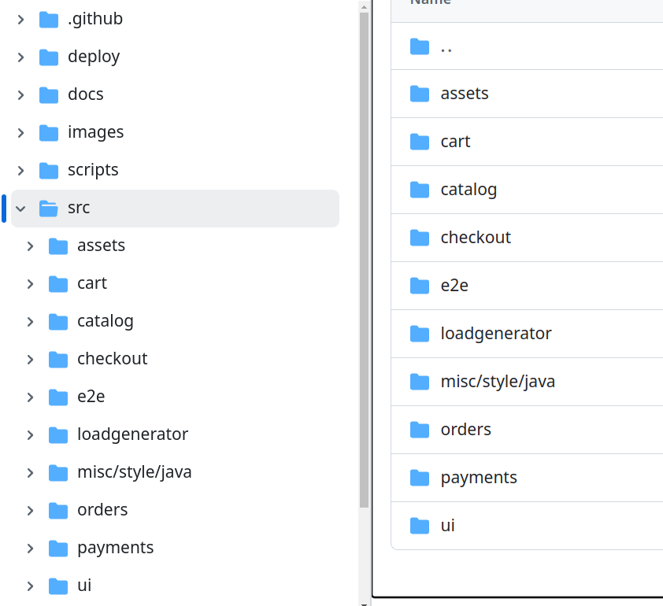

---
# You can also start simply with 'default'
theme: geist
# random image from a curated Unsplash collection by Anthony
# like them? see https://unsplash.com/collections/94734566/slidev
# background: https://cover.sli.dev
# some information about your slides (markdown enabled)
title: API Architectures and Principles by Nischal Dahal
description: API Architectures
info: |
  # API Presentation
# apply unocss classes to the current slide
class: w-[80%] m-auto
twoslash: true
highlighter: shiki
favicon: "https://avatars.githubusercontent.com/u/98168009?v=4"
# https://sli.dev/features/drawing
addons:
  - excalidraw
# slide transition: https://sli.dev/guide/animations.html#slide-transitions
transition: view-transition
# enable MDC Syntax: https://sli.dev/features/mdc
mdc: true

themeConfig:
  primary: "#9826ab"
  secondary: "#25660e"
  primary-highlight: "#e7e7e710"
  secondary-highlight: "#efefef10"
# layout: center

drawings:
  enabled: true
  persist: false
  presenterOnly: false
  syncAll:

# HTML tag attributes
htmlAttrs:
  dir: ltr
  lang: en
---

# Nischal presents

---
layout: center
transition: slide-right
class: w-[80%] m-auto text-primary
---

# La aayo presentation!

<span v-mark.underline>dhila ta vayena ni?</span>

---
layout: cover
transition: slide-right
class: w-[80%] m-auto
image: /images/qr.png
---

<div class="flex gap-10 items-start justify-center">


<div> 
<h1 class='leading-none'>Nischal Dahal</h1>

- Currently working at <KBD>[AITC](https://aitc.ai/)</KBD>
- <KBD>+4</KBD  > ( 2 Yrs Professional and 2 Self Experiences )
- Nepal, Mainapokhari, Dolakha
- Blog & Portfolio <KBD>[nischal-dahal.com](https://nischal-dahal.com.np)</KBD>
- <span v-mark.underline.orange>Say Hi on</span> <KBD>[X - broisnees](https://x.com/broisnees)</KBD>, <span v-mark.underline.green> Follow me on</span> <KBD>[github.com/broisnischal](https://github.com/broisnischal)</KBD> and connect on Linkedin [broisnees](https://linked.com/in/broisnees)
</div>

</div>

<!-- <div
  v-motion
  :initial="{ x: -80 }"
  :enter="{ x: 0 }"
  :leave="{ x: 80 }"
>
  Slidev
</div> -->

<!-- <KBD>I'm a Keyboard Input</KBD> -->

<!-- # API Architectures -->

<!-- |                    |             |
| ------------------ | ----------- |
| <kbd>REST </kbd>   | Restful API |
| <kbd>GraphQL</kbd> | Restful API |
| <kbd>gRPC</kbd>    | Restful API | -->

<!-- <div class="pt-12">
  <span @click="$slidev.nav.next" class="px-2 py-1 rounded cursor-pointer" hover="bg-white bg-opacity-10">
    Press Space for next page <carbon:arrow-right class="inline"/>
  </span> -->
<!-- </div> -->

<!-- <div class="abs-br m-6 flex gap-2">
  <button @click="$slidev.nav.openInEditor()" title="Open in Editor" class="text-xl slidev-icon-btn opacity-50 !border-none !hover:text-white">
    <carbon:edit />
  </button>
  <a href="https://github.com/slidevjs/slidev" target="_blank" alt="GitHub" title="Open in GitHub"
    class="text-xl slidev-icon-btn opacity-50 !border-none !hover:text-white">
    <carbon-logo-github />
  </a>
</div> -->

<!--
The last comment block of each slide will be treated as slide notes. It will be visible and editable in Presenter Mode along with the slide. [Read more in the docs](https://sli.dev/guide/syntax.html#notes)
-->

---
layout: cover
class: w-[80%] m-auto
transition: slide-down
---

## Todays Agenda

What we are going to focus and learn about

- 📝 **API** - What is API and types of APIs?

<v-clicks>

- 🎨 **API Scalability** - Why a scalability?
- 🧑‍💻 **API Testing** - types of API Testing
- 🤹 **Architectures** - How to work with different API arch as non backend developer.
- 🎥 **Serverless** - What is serverless and why to adopt?
- 🎥 **Edge Functions** - Serve fast, personalized content with logic that executes at the edge.
- 🛠 **Monorepo,Microservices** - virtually anything that's possible on a webpage is possible in Slidev
- 📤 **Remix?** - why it?

</v-clicks>

  <br>
  <br>

Read more about [api?](https://sli.dev/guide/why)

<!--
You can have `style` tag in markdown to override the style for the current page.
Learn more: https://sli.dev/features/slide-scope-style
-->

<style>
h2 {
  background-color: #2B90B6;
  background-image: linear-gradient(45deg, #4EC5D4 10%, #146b8c 20%);
  background-size: 100%;
  -webkit-background-clip: text;
  -moz-background-clip: text;
  -webkit-text-fill-color: transparent;
  -moz-text-fill-color: transparent;
}
</style>

<!--
Here is another comment.
-->

---
level: 1
class: w-[80%] m-auto text-center
layout: center
---
# Artificial Intelligence

How AI can be integrated in our application?

---


---
level: 2
class: w-[80%] m-auto
layout: center
---

# API

Two software components to communicate with each other using a set of definitions and protocols!

#### <span v-mark="{ color: '#234', type: 'circle' }">Our process</span> 


<div v-click> API baneko xaina </div>
<div v-click> Data aako xaina </div>
<div v-click> Backend ko issue ho! </div>
<div v-click> Count nai mistake chha! </div>
<div v-click> Tapaile check garnu vako thyena? </div>


<!-- <Arrow v-bind="{ x1:10, y1:10, x2:200, y2:200 }" /> -->


<p v-click class="absolute bottom-10 left-45 transform -rotate-10">AITC!</p>

---
level: 1
class: w-[80%] m-auto
layout: two-cols
---

# Types of APIs

<div v-click>Private APIs</div>
<div v-click>Public APIs</div>
<div v-click>Open APIs</div>
<div v-click>Partner APIs</div>
<div v-click>Composite APIs</div>

<p v-after class="absolute bottom-23 left-45 transform -rotate-10">Here!</p>


::right::

<div v-click class="text-2xl"> How to create an API? </div>
<br/>
<div v-click>Plan the API</div>
<div v-click>Build the API</div>
<div v-click>Test the API</div>
<div v-click>Document the API</div>
<div v-click>Market the API</div>

---
layout: image-right
class: w-[80%] m-auto
image: https://www.mulesoft.com/sites/default/files/cmm_files/Best-Practices-for-Building-a-Secure-and-Scalable-API-02-AWS-load-balancing.png
backgroundSize: 70%

---


# API Scalability

Scalability in API development is a bit like laying down the foundations for a new building; strong foundations are crucial for any future expansion.

<div>
  <ul>
    <li>Statelessness</li>
    <li>Loose Coupoling</li>
    <li>Vertical and Horizontal Scaling</li>
    <li>Resources oriented Design</li>
    <li>Asynchronous Operations</li>
    <li>Strategic Cacheing</li>
    <li>Efficient Database Usage</li>
    <li>Load Balancing & Rate Limiting</li>
  </ul>
</div>
<br/>

::right::

# Right

This shows on the right

---
layout: two-cols
layoutClass: gap-16
class: w-[80%] m-auto
---

### API Scalability

<div v-click>
  <h1>Statelessness</h1>
  <p>
  Each request is independent, reducing server memory load.
  </p>
</div>

<div v-click>
  <h1>Loose Coupling</h1>
  <p>
    Components interact with minimal dependencies, allowing easier scaling.
  </p>
</div>


---
layout: two-cols
layoutClass: gap-16
class: w-[80%] m-auto
---


<div>
  <h1>Vertical & Horizontal Scaling</h1>
  <p>
    Add resources (vertical) or machines (horizontal) to meet growing demands.
  </p>
</div>

<div v-click>
  <h1>Resource-Oriented Design</h1>
  <p>
  Focus on data/services rather than actions.
   
  </p>
</div>


---
layout: two-cols
layoutClass: gap-16
class: w-[80%] m-auto
---


<div>
  <h1>Asynchronous Operations</h1>
  <p>
Non-blocking tasks improve efficiency.  </p>
</div>

<div v-click>
  <h1>Strategic Caching</h1>
  <p>
Cache frequently used data to reduce server load.   
  </p>
</div>


---
layout: two-cols
layoutClass: gap-16
class: w-[80%] m-auto
---


<div>
  <h1>Efficient Database Usage</h1>
  <p>
    Optimize queries and indexing for better performance.
    </p>
</div>
<div v-click>
  <h1>API Rate Limiting</h1>
  <p>Control the number of requests to maintain performance.</p>
</div>

---
layout: center
class: w-[80%] m-auto
---

## Challenges in Scalable API Development

- Legacy System Integration: Requires careful planning for seamless scaling.
- Load Distribution: Dynamic resource allocation and load balancing are critical.
- Data Consistency: Database sharding and replication help maintain reliability.
- Security Measures: Scalable APIs require evolving security protocols.
- Comprehensive Testing: Continuously test to ensure API performance under various conditions.

<div v-click>

## Conclusion

Scalability is essential for API-driven success.
Design with growth in mind and continuously improve.
Your software should be ready to scale and adapt to future demands.
</div>

---
layout: two-cols
layoutClass: gap-16
class: w-[80%] m-auto
---

# API Architectures

API architecture is the framework of principles, practices, and patterns that guide the design, development, deployment, and maintenance of Application Programming Interfaces (APIs).

<div v-click class="text-red-400">
  Here are some common and popular API architectures :
</div>

<!-- 
```html
<Toc minDepth="1" maxDepth="1"></Toc>
```

The title will be inferred from your slide content, or you can override it with `title` and `level` in your frontmatter. -->

::right::

<!-- <Toc v-click minDepth="1" maxDepth="2"></Toc> -->

<div v-click>

- SOAP
- REST
- GraphQL
- Websocket
- Webhook
- tRPC
- gRPC
- MQTT
- Streaming API
- SSE
</div>

---
layout: center
class: w-[80%] m-auto
---

## API Testing

API Testing is the process of validating and verifying Application Programming Interfaces (APIs). It ensures the API’s functionality, performance, reliability, and security. The focus is on checking requests and responses, data formats, and communication between systems, without a UI, to catch errors early and ensure seamless integration between components.

Test Flight, Ad-hoc Testing, UI Testing, Exploratory Testing

---
layout: image
class: w-[80%] m-auto
image: https://i.ytimg.com/vi/qquIJ1Ivusg/maxresdefault.jpg
backgroundSize: 70%
---


---
layout: image-right
image: https://www.zentao.pm/file.php?f=202012/f_4c07f77b56c63635a3e319245ba5d49d&t=png&o=&s=&v=1607586173
backgroundSize: 70%
class: w-[80%] m-auto
---


# Functional Testing

- Goal: Check whether the API meets its functionality requirements.
- Example: Testing if an API correctly returns user information when called with the right ID.


---
layout: image-right
image: https://wp.testbytes.net//wp-content/uploads/2020/04/Load-Testing-1.jpg
backgroundSize: 70%
class: w-[80%] m-auto
---


# Load Testing

- Goal: Verify API performance under heavy traffic.
- Example: Simulating multiple requests to ensure the API handles concurrent users efficiently.


---
layout: image-right
image: https://brightsec.com/wp-content/uploads/2023/07/Slice-4-1024x472.png
class: w-[80%] m-auto
backgroundSize: 90%
---


# Security Testing

- Goal: Protect the API against vulnerabilities.
- Example: Ensuring the API enforces authentication and data encryption.

---
layout: image-right
image: https://www.edureka.co/blog/wp-content/uploads/2019/01/Types2.png
backgroundSize: 70%
class: w-[80%] m-auto
---


# Penetration Testing

- Goal: Simulate external attacks to identify potential security flaws.
- Example: Checking for issues like SQL injection and broken authentication.

---
layout: image-right
image: https://miro.medium.com/v2/resize:fit:1400/1*0G2M2EUIW45p2BSBR3hRQw.jpeg
backgroundSize: 70%
class: w-[80%] m-auto
---


# End-to-End Testing

- Goal: Test a complete user flow that involves multiple APIs.
- Example: Checking the user registration process from API to database and back.


---
layout: image-right
image: https://www.opencodez.com/wp-content/uploads/2018/12/Performance_Testing_Types-1.png
backgroundSize: 80%
class: w-[80%] m-auto
---


## Runtime / Performance 

- Goal: Monitor API behavior under execution to ensure performance.
- Example: Checking API response times during peak load.

---
layout: image-right
image: https://s3.amazonaws.com/algoworksupload/new-algoworks/wp-content/uploads/2016/04/26120022/uiTesting_mobileT.png
backgroundSize: 70%
class: w-[80%] m-auto
---


# UI Testing

- Goal: Ensure smooth interaction between the frontend and API.
- Example: Validating whether the UI displays correct data fetched from the API.

---
layout: image-right
image: https://i.ytimg.com/vi/pcEy-4eZF6g/maxresdefault.jpg
backgroundSize: 100%
class: w-[80%] m-auto
---


# Fuzz Testing

- Goal: Test the robustness of an API by sending random or invalid data.
- Example: Ensuring that the API can gracefully handle unexpected input without crashing.


---
layout: center
class: w-[80%] m-auto
---

## Best Practices for API Testing
- Test Early and Often: Integrate API tests in CI/CD pipelines.
- Automate: Use tools like Postman, SoapUI, or JMeter.
- Monitor Performance: Use APM tools to track response times and system behavior.
- Secure Your API: Implement authentication, authorization, and encryption checks.
- Test in Different Scenarios: Consider edge cases, invalid inputs, and large data sets.


---
layout: iframe-right

class: w-[80%] m-auto
url: https://en.wikipedia.org/wiki/Serverless_computing
---

# Serverless

Serverless is a cloud-native model where developers focus on writing code without managing underlying infrastructure.

<!-- Serverless doesnot mean there is no server, it simply means that you don't operate your own server, typically building a server environment requires time and maintenance effort to make sure it's always running and bug free since you are responsible for that server. -->

Advantages
- Have not to worry about handles server management, scaling, and maintenance
- Easy Integration
- Less Maintenance
- Simple Scaling
- Focus on CODE rather than Infrastructure

---
layout: default
class: w-[80%] m-auto
---

### Example Providers

 AWS Lambda, Azure Functions, Google Cloud Functions

## Example Use Case
#### Real-time File Processing:

- User uploads file to cloud storage (e.g., S3 bucket).
- Triggers a Lambda function that processes and stores the result.
- Scalable and cost-effective for on-demand processing tasks.


---
layout: iframe-right
class: w-[80%] m-auto
url: https://nischal-dahal.com.np/blog/where-to-host-your-modern-applications
---

### Edge Computing

Edge Computing refers to processing data closer to the source of data generation rather than relying on a centralized data-processing warehouse. It minimizes latency, reduces bandwidth usage, and enhances real-time data processing.

Key Advantages

- Reduced Latency: Faster response times for applications requiring real-time data processing.
- Bandwidth Efficiency: Reduces the amount of data sent to central servers, saving bandwidth.
- Enhanced Security: Sensitive data can be processed locally, reducing exposure to external threats.
- Scalability: Easier to scale as more edge devices can be added without overloading central systems.

Future Trends
- Increased AI Integration: More edge devices will incorporate AI for advanced analytics and decision-making.


---
layout: two-cols-header
layoutClass: gap-16
class: w-[80%] m-auto
---

::left::

# Monolithic

Monolithic architecture is a software design where the entire application is built as a single, unified unit.

Characteristics:

- Single codebase
- Tight coupling of features
- Single database for all components
- Everything deployed and scaled together


Monorepo,

::right::
# Microservices

<!-- When to Use Microservices?

When scaling is crucial: Apps with high traffic and need for independent scaling.
Frequent updates: Applications that require regular updates without downtime.
Decentralized teams: Teams working on different parts of the application independently.
Slide 11: When NOT to Use Microservices?

Small Projects: If the application is simple and doesn’t need complex scaling.
Teams new to microservices: The learning curve might slow development initially.
Real-time, latency-sensitive apps: Microservices might add network latency. -->

Microservices are a software architecture style where an application is built as a collection of small, independent services.

Characteristics:

- Loosely coupled
- Independently deployable
- Organized around business capabilities
- Decentralized data management
<!-- 
Tools & Technologies for Microservices

- Containerization: Docker
- Orchestration: Kubernetes
- Service Discovery: Consul, Eureka
- API Gateway: Kong, NGINX
- Messaging: Kafka, RabbitMQ
- Monitoring: Prometheus, Grafana
- Logging: ELK Stack (Elasticsearch, Logstash, Kibana) -->


---
layout: image-right
image: /images/pattern.gif
class: w-[80%] m-auto
backgroundSize: 70%
# url: https://github.com/broisnischal/gcp-terraform
---


<a href="https://github.dev/broisnischal/gcp-terraform" target="_blank">Demo Monolithic</a>

##### Demo Microservices



---
layout: center
class: text-center
---

# Any Questions?

[Blog](https://nischal-dahal.com.np/blog) · [GitHub](https://github.com/broisnischal) 

**ping@nischal.pro**
